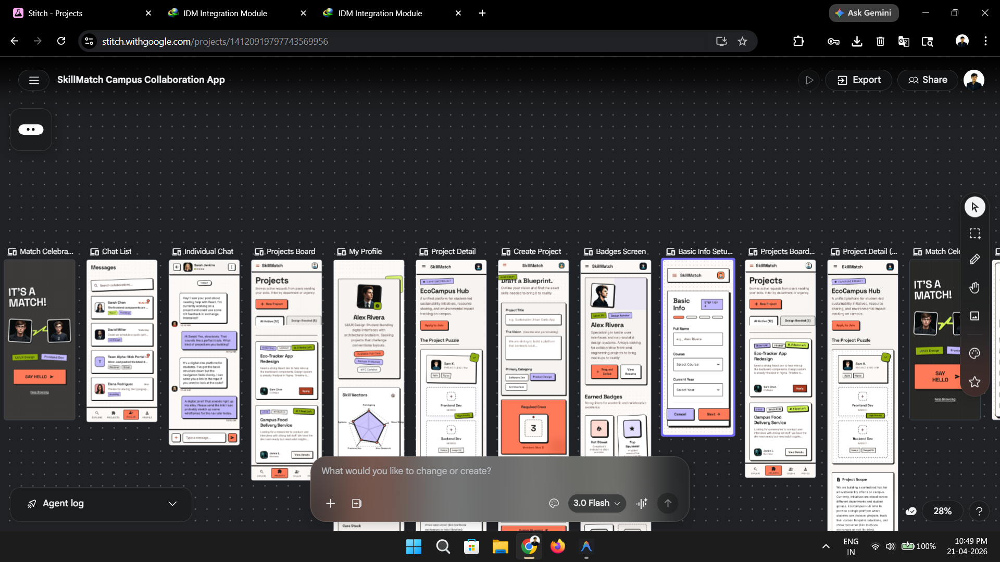

# SkillMatch

SkillMatch is a Flutter-based campus collaboration platform designed to help students discover talent, form meaningful connections, unlock chat through mutual matching, and collaborate on live projects.

Built with Flutter and Supabase, the app combines profile-driven discovery, real-time collaboration flows, project participation, lightweight gamification, and an admin layer for moderation and system oversight.

## At a Glance

- Flutter + Supabase campus collaboration app
- Mutual-match networking with gated chat
- Project discovery and collaboration requests
- Gamification through streaks, badges, and skill assessments
- Admin tooling for visibility and system actions
- Web-first development workflow with Android support

## Design Preview

The current app is aligned against a Stitch design exploration for the same product direction.



## Highlights

- Mutual-match based networking
- Chat unlocked only after both users match
- Project archive with join / engage requests
- Profile setup, editing, and photo upload
- Badges, streaks, skill assessments, and leaderboard
- Admin dashboard and moderation entry points
- Web-first testing flow with Android support

## Product Overview

SkillMatch is positioned as a practical student collaboration network rather than a static social profile app. The core experience is designed around:

- discoverability through skills and roles
- intentional connections through reciprocal matching
- structured collaboration through project workflows
- ongoing engagement through streaks, badges, and assessments
- operational control through an admin surface

## Core User Flows

### 1. Authentication and onboarding
- Email OTP login
- Guided onboarding flow
- Basic profile, skills, photo, and quiz setup

### 2. Discovery and matching
- Browse real user profiles
- Search by skill, role, or name
- Send interest to other users
- Unlock chat only after reciprocal match

### 3. Projects
- Create project entries
- View project details and roadmap
- Engage with projects through collaboration requests

### 4. Gamification
- Daily streak claim
- Badge earning through activity
- Skill assessment modules
- Leaderboard based on user progress / XP

### 5. Admin controls
- Admin-only dashboard access
- Visibility into users, projects, matches, and messages
- Admin entry path for the configured admin account

## Tech Stack

- **Frontend:** Flutter
- **State management:** Riverpod
- **Routing:** GoRouter
- **Backend:** Supabase
- **Storage:** Supabase Storage
- **Auth:** Supabase OTP Authentication

## Feature Map

| Area | Current Scope |
| --- | --- |
| Auth | OTP email login, onboarding, profile completion |
| Discovery | Profile browse, search, match intent |
| Chat | Mutual-match gated messaging |
| Projects | Create, inspect, roadmap, engage |
| Profile | Edit profile, upload photo, skill display |
| Gamification | Streaks, badges, leaderboard, evaluations |
| Admin | Metrics, action entry points, admin-only access |

## Project Structure

```text
lib/
  providers/        App state, services, Supabase data logic
  router/           Route configuration
  screens/          Auth, onboarding, chat, project, core app UI
  theme/            App theme and shared visual tokens
  widgets/          Shared layout and navigation widgets

supabase/
  skillmatch_schema.sql   Schema + policies + repair SQL

test/
  skillmatch_smoke_test.dart
```

## Local Development

### Run in Chrome

```bash
flutter pub get
flutter run -d chrome
```

### Run as local web server

```bash
flutter run -d web-server --web-hostname 127.0.0.1 --web-port 8085
```

### Useful dev commands

```bash
flutter analyze
flutter test
flutter build web --debug
```

## Supabase Setup

Run the SQL below in the Supabase SQL editor:

```text
supabase/skillmatch_schema.sql
```

This script is intended to:

- create missing tables
- add missing columns to existing tables
- configure row-level security policies
- seed core badge data
- configure avatar storage access
- reload the PostgREST schema cache

## Validation

Typical validation during active development:

- `flutter analyze`
- `flutter test`
- `flutter build web --debug`

## Android Build

```bash
flutter build apk --release
```

Note: the current release APK uses debug signing unless a production signing configuration is added.

## Current Product Status

The app currently includes working implementations or fallbacks for:

- authentication
- onboarding
- profile editing
- discover and match flows
- chat
- project engagement
- badges / streaks / leaderboard
- admin dashboard

Some features are intentionally resilient to partial backend setup, but the full experience depends on running the provided Supabase SQL successfully.

## Deployment Note

The repository contains the active app workspace and schema repair SQL, but production-grade release management still requires:

- a proper Android signing setup
- finalized Supabase schema migration strategy
- environment separation for staging and production

## Repository Notes

- Generated logs and local analysis artifacts are ignored from version control.
- This repository is meant to track the active SkillMatch app workspace, not temporary build output.

## Roadmap

- production-grade release signing
- richer README visuals and screenshots
- cleaner Supabase migrations split by concern
- richer evaluation games and interactive flows
- stronger admin moderation tooling

---

SkillMatch is being actively iterated as a practical, portfolio-quality collaboration app rather than a static UI mock.
